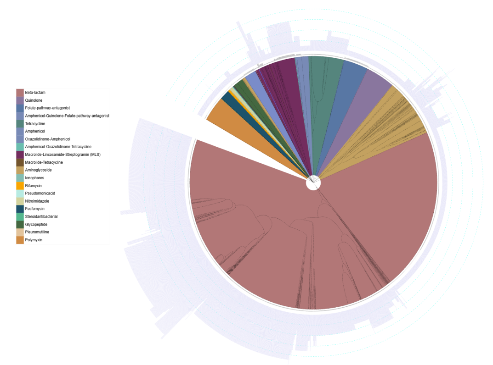

# Phenotypic Resistance Diversity Index (PRDI)

The Phenotypic Resistance Diversity Index (PRDI) quantifies the functional diversity of a resistome by accounting for the predicted resistance phenotypes associated with acquired antibiotic resistance genes (ARGs).

### How is PRDI calculated?

PRDI is calculated from a phenotype-informed ARG tree in which ARGs are organized according to the similarity of their predicted resistance phenotypes.

<p align="center">
  
</p>

For each sample, detected ARGs are mapped to this tree. PRDI is then calculated using Faith's phylogenetic diversity formulation, as the total branch length of the tree connecting the detected ARGs.

### Installation

PRDI calculation requires Python ≥ 3 and the dependencies listed in `requirements.txt`.

```bash
git clone https://github.com/motleystate/InSPIRe_VagResist.git
```
```bash
# Create and activate a dedicated Conda environment (optional):
conda create -n prdi python
conda activate prdi
```
```bash
# Install dependencies
cd InSPIRe_VagResist/prdi 
python -m pip install -r requirements.txt
```

The files required for PRDI calculation are provided in the `data/` directory:

- `RF_gene_info_dict.json`: mapping between ResFinder ARG names and accession numbers.
- `PhenoARGTree.newick`: phenotype-informed ARG tree used for PRDI calculation.

### Input data

The input file must be a tab-separated ARG abundance table with samples (SampleID) as rows and ResFinder acquired ARG names as columns (see example `prdi/test/prdi_data_test.txt`).

Example:

| SampleID | erm(B) | tet(M) | blaTEM-1A | lsa(C) |
|---|---:|---:|---:|---:|
| Sample_01 | 0 | 125.4 | 0 | 42.1 |
| Sample_02 | 35.2 | 0 | 18.7 | 0 |
| Sample_03 | 0 | 0 | 0 | 0 |

### Usage

```bash
cd InSPIRe_VagResist/prdi
python compute_prdi.py -i test/prdi_data_test.txt -o test/prdi_test_output.tsv
```

Command-line options:

```bash
python compute_prdi.py --help
```

```text
-i, --input     Input ARG abundance table (TSV).
-o, --output    Output PRDI table (TSV).
-h, --help      Show the help message and exit.
```

### Output

The output is a tab-separated file containing the PRDI value calculated for each sample.

Example:

| SampleID | PRDI |
|---|---:|
| Sample_01 | 4.823 |
| Sample_02 | 2.147 |
| Sample_03 | 0.000 |

### How to interpret PRDI ?

PRDI interpretation is based on the fact that ARGs with similar predicted resistance profiles contribute less additional diversity than ARGs associated with distinct resistance profiles.

- **low PRDI** indicates that the ARGs detected in a sample represent a limited diversity of predicted resistance phenotypes.
- **high PRDI** indicates a broader functional diversity of predicted resistance phenotypes.

*Note: for samples without any detected ARG, PRDI = 0.*

#### Limitations

PRDI is based on predicted resistance phenotypes associated with acquired ARGs. The presence of an ARG does not necessarily imply its expression or phenotypic resistance. Without clinical validation, PRDI should be interpreted as a resistome diversity metric rather than a clinical score.

By definition, PRDI depends on the completeness of the phenotype annotations used to construct the ARG tree. Nevertheless, it provides a useful proxy for the diversity of resistance mechanisms represented within a resistome. PRDI should therefore be interpreted alongside conventional count-based metrics as a complementary measure of resistome diversity.

### References
1. Faith, D. P. Conservation evaluation and phylogenetic diversity. Biological Conservation 61, 1–10 (1992). 

### Citation
If you use PRDI, please cite:
Boutouchent N, Baud A, Tazi A, et al. "*Bacterial community structure shapes the vaginal resistome during pregnancy.*" npj Biofilms and Microbiomes (2026).https://doi.org/10.1038/s41522-026-01144-y